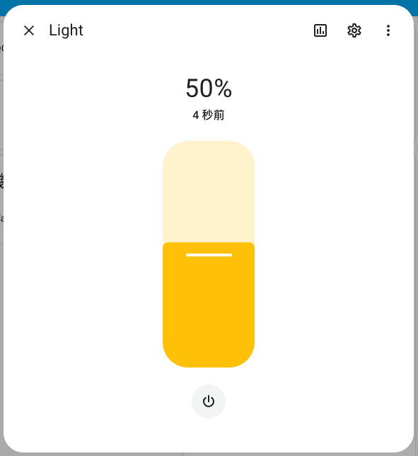

# LightBoxy

Home Assistant connects to ESP8266 [^1] via MQTT [^2] to adjust the brightness of smart lights.



## Home Assistant

The `configuration.yaml` is set as follows.

```yaml
mqtt:
  - light:
      name: "Light"
      state_topic: "lightboxy/switch/outTopic"
      command_topic: "lightboxy/switch/inTopic"
      brightness_state_topic: "lightboxy/brightness/outTopic"
      brightness_command_topic: "lightboxy/brightness/inTopic"
      qos: 0
      payload_on: "1"
      payload_off: "0"
      optimistic: false
```

## ESP8266

Please replace the environment variable.

```cpp
const char *ssid = "YOUR_WIFI_SSID";
const char *password = "YOUR_WIFI_PASSWORD";
const char *mqtt_server = "YOUR_MQTT_SERVER";
const char *mqtt_name = "YOUR_MQTT_SERVER_NAME";
const char *mqtt_password = "YOUR_MQTT_SERVER_PASSWORD";
```

## Reference

[^1]: ESP8266, https://github.com/esp8266/Arduino

[^2]: MQTT Light, https://www.home-assistant.io/integrations/light.mqtt/